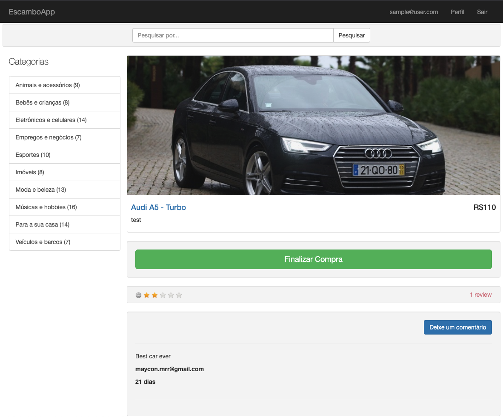

# Ruby on Rails - Ecommerce
This project has the main necessary features to start an ecommerce project.

User registration, ads creation (you can create an add with pitcutures and description to sell your products) and review session for buyers.
It also has a backoffice session where is possible to control the whole system.

# Website Preview
Ads Session


- - - - -


Backoffice Session


- - - - -


## Ruby version
ruby 2.7.0

## Rails version
Rails 6.0.2

## System dependencies

* Any *nix plataform


* ImageMagick (https://www.imagemagick.org)

```
sudo apt-get update
sudo apt-get install imagemagick libmagickwand-dev
```

* Graphviz (https://www.graphviz.org)

```
sudo apt-get update
sudo apt-get install graphviz
```

## Setup
Run in your console:
```
bin/setup
```

## Rake Tasks

Run in you console:
```
rails dev:setup
```
